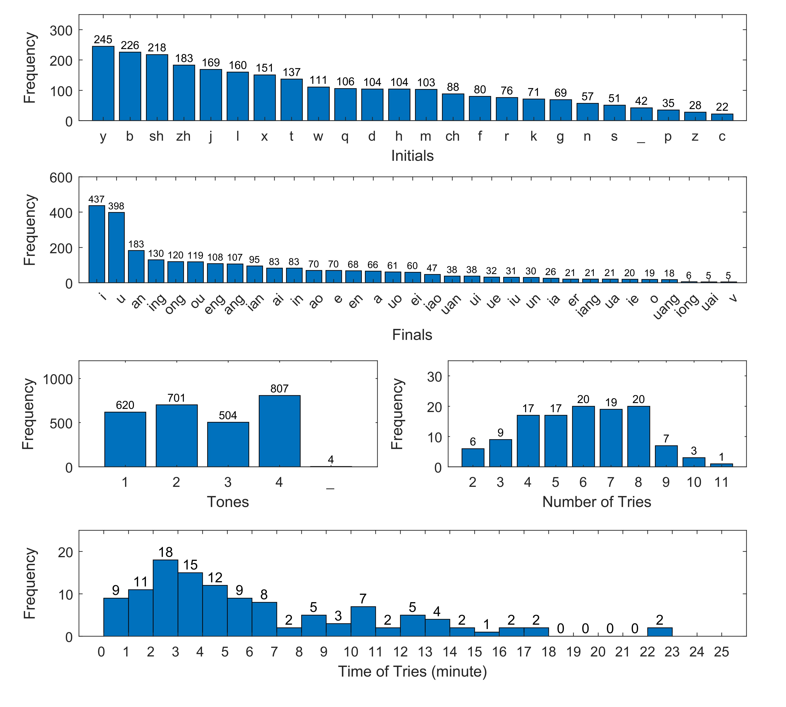

# 汉兜猜词记录

需要`pypinyin, wordcloud, PIL, numpy, matplotlib`库。

## 文件说明

`idiom`文件夹储存成语列表。

`./idiom/THUOCL_chengyu.txt`是一份成语列表，来自[THUOCL：清华大学开放中文词库](http://thuocl.thunlp.org/)，包含8000余条成语。

`./idiom/idioms.txt`也是一份成语列表，来自开源项目[汉兜 Handle](https://github.com/antfu/handle)，包含2万余条成语，好像缺一些常见成语。

`mask.png`用于生成词云的形状。

`output`文件夹内的文件以字典形式储存了猜词记录中的成语频率、声母频率、韵母频率和声调频率。

`qiji-combo.tff`是词云采用的字体，来自开源项目[齊伋體 qiji-font](https://github.com/LingDong-/qiji-font)。

`summary.json`储存有每日的猜词记录，含日期、时间、是否提示和猜测所用的成语列表，纯手工打造。

`summary.py`是主程序。

`wc_idiom.jpg`是成语词云。

## 词云输出效果

## 猜词记录统计

